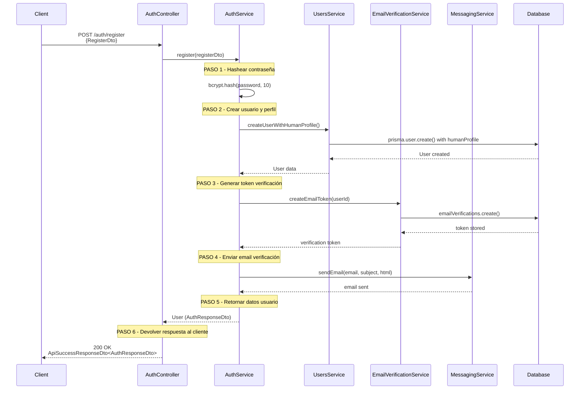
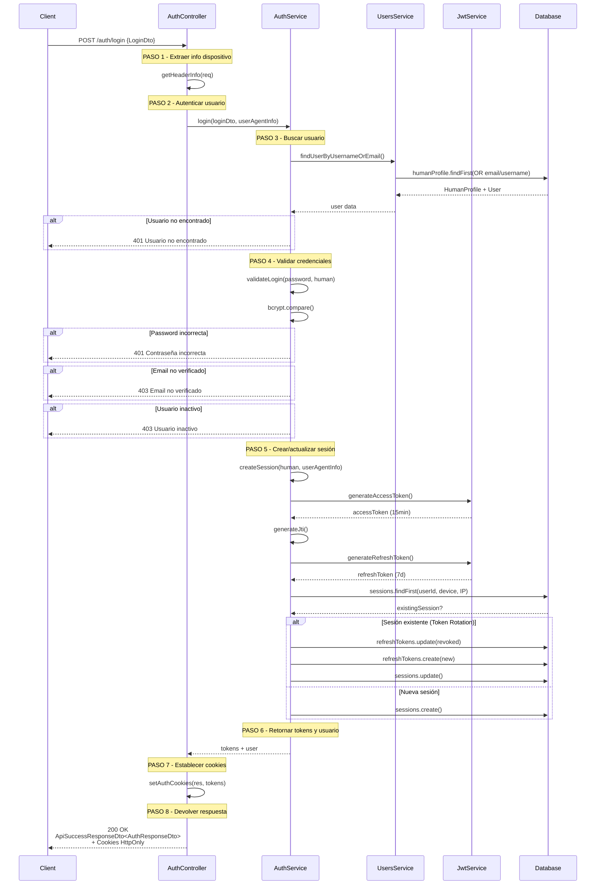
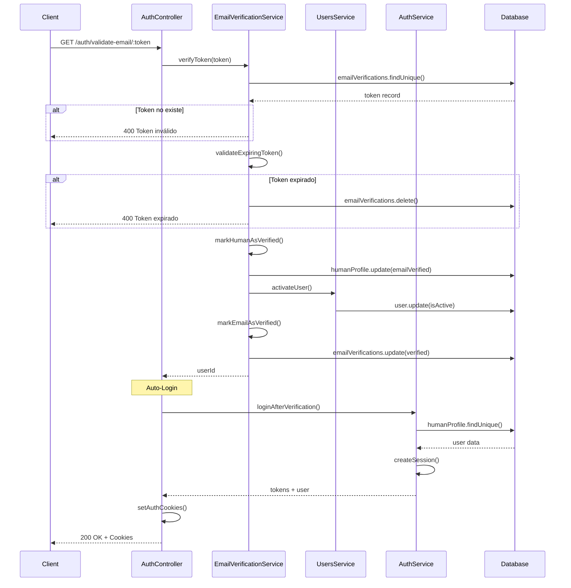
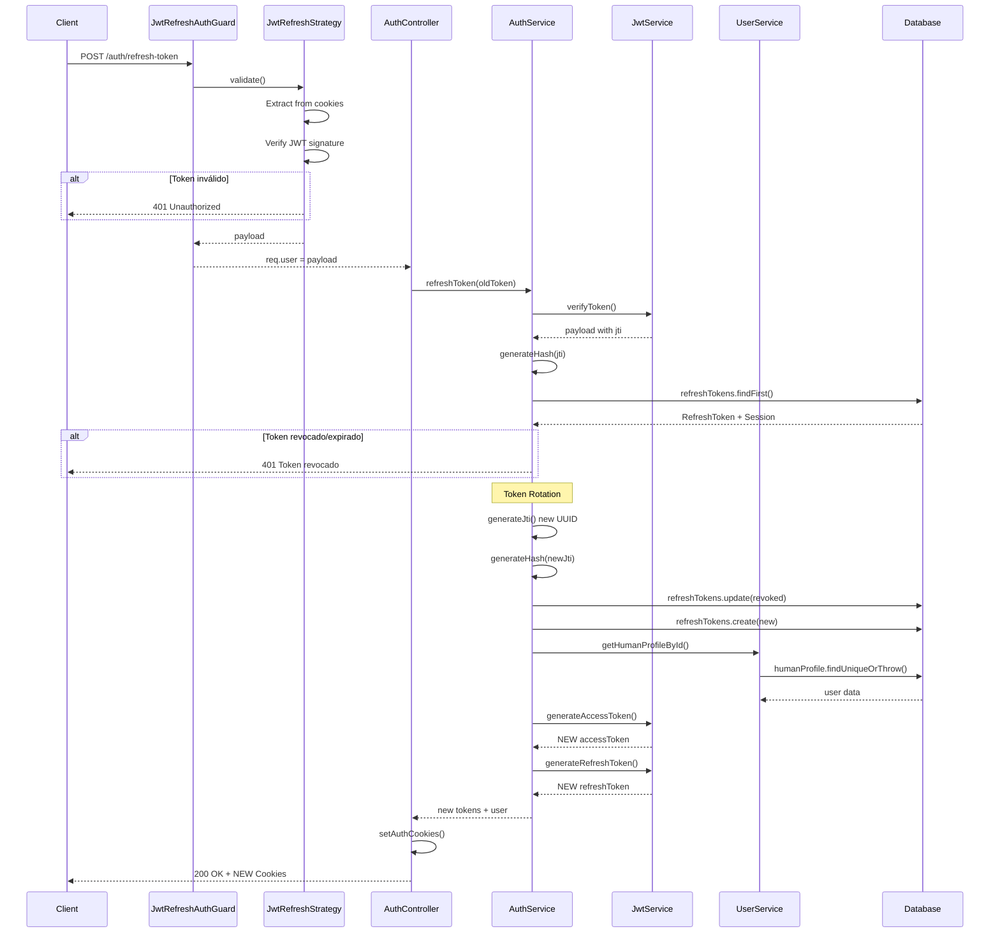
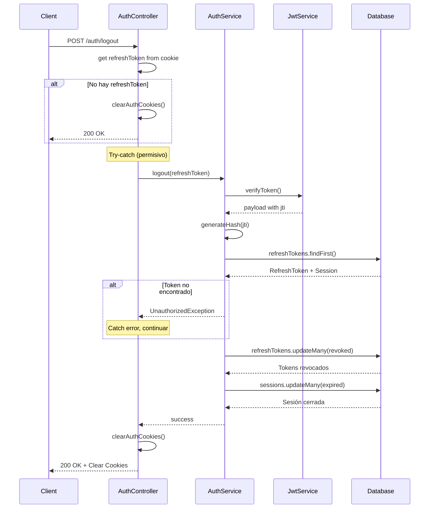
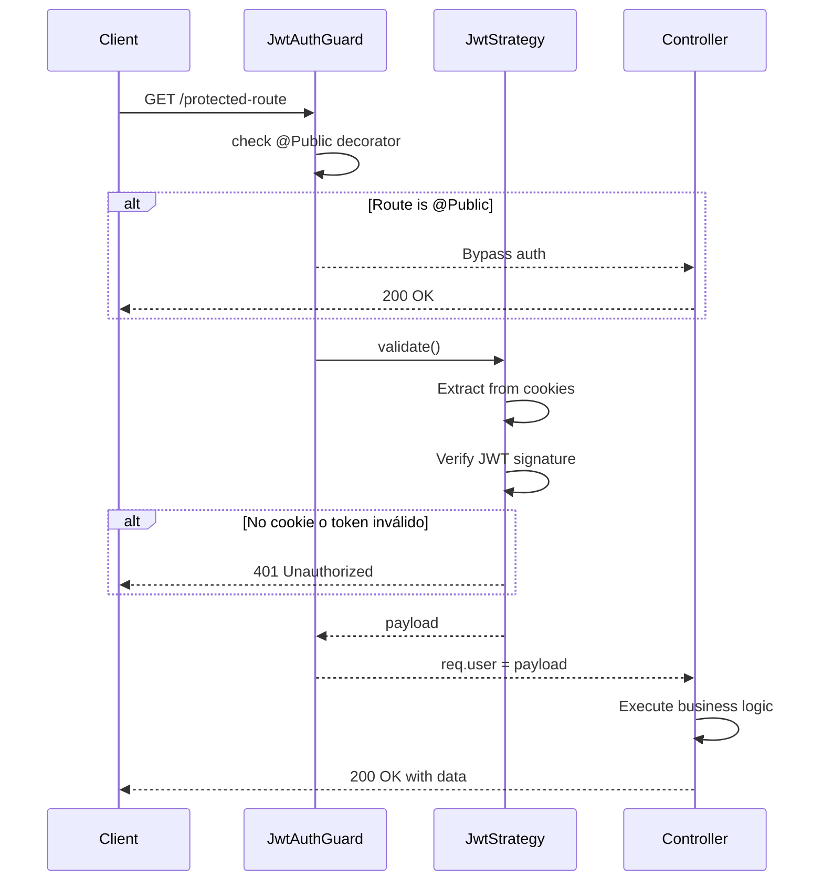

# Sistema de Autenticación - Miyoru Backend

Documentación completa de los flujos de autenticación con DTOs explícitos y estructuras de datos reales.

---

## 📊 Flujo 1: Registro de Usuario

### Request DTO: `RegisterDto`

```typescript
{
  userType?: UserType,      // Opcional, default: HUMAN
  displayName: string,      // "Juanito"
  username: string,         // "juanito123"
  fullName: string,         // "Juan Pérez"
  email: string,            // "juanito@example.com"
  password: string          // "secreto123" (min 6 chars)
}
```

### Response: `ApiSuccessResponseDto<AuthResponseDto>`

```typescript
{
  success: true,
  message: "Usuario registrado exitosamente.",
  data: {
    userType: UserType,     // "HUMAN"
    displayName: string,    // "Juanito"
    avatarUrl: string | null,
    isActive: boolean,      // false (requiere verificación)
    createdAt: Date
  }
}
```

### Diagrama de Flujo



---

## 📊 Flujo 2: Login

### Request DTO: `LoginDto`

```typescript
{
  emailOrUsername: string,  // "juanito@example.com" o "juanito123"
  password: string          // "secreto123"
}
```

### Response: `ApiSuccessResponseDto<AuthResponseDto>`

```typescript
{
  success: true,
  message: "Usuario autenticado exitosamente.",
  data: {
    userType: UserType,
    displayName: string,
    avatarUrl: string | null,
    isActive: boolean,
    createdAt: Date
  }
}
// + Cookies: accessToken, refreshToken (HttpOnly)
```

### Diagrama de Flujo



---

## 📊 Flujo 3: Validación de Email (Auto-Login)

### Request

```
GET /auth/validate-email/:token
```

### Response: `ApiSuccessResponseDto<AuthResponseDto>`

```typescript
{
  success: true,
  message: "Email verificado y sesión iniciada exitosamente.",
  data: {
    userType: UserType,
    displayName: string,
    avatarUrl: string | null,
    isActive: boolean,      // true (activado)
    createdAt: Date
  }
}
// + Cookies: accessToken, refreshToken
```

### Diagrama de Flujo



---

## 📊 Flujo 4: Refresh Token

### Request

```
POST /auth/refresh-token
Cookie: refreshToken=eyJhbGc...
```

### Response: `ApiSuccessResponseDto<AuthResponseDto>`

```typescript
{
  success: true,
  message: "Tokens renovados exitosamente.",
  data: {
    userType: UserType,
    displayName: string,
    avatarUrl: string | null,
    isActive: boolean,
    createdAt: Date
  }
}
// + Cookies: NEW accessToken, NEW refreshToken
```

### Diagrama de Flujo



---

## 📊 Flujo 5: Logout

### Request

```
POST /auth/logout
Cookie: refreshToken=eyJhbGc...
```

### Response: `ApiSuccessResponseDto<LogoutResponseDto>`

```typescript
{
  success: true,
  message: "Usuario desconectado exitosamente.",
  data: {
    loggedOutAt: Date  // "2024-01-15T10:30:00Z"
  }
}
// + Clear-Cookie: accessToken, refreshToken
```

### Diagrama de Flujo



---

## 📊 Flujo 6: Acceso a Ruta Protegida

### Request

```
GET /protected-route
Cookie: accessToken=eyJhbGc...
```

### Diagrama de Flujo



---

## 📋 DTOs y Estructuras de Datos

### Request DTOs

#### `RegisterDto`

```typescript
{
  userType?: UserType,      // Opcional, default: HUMAN
  displayName: string,      // Nombre a mostrar
  username: string,         // Nombre de usuario único
  fullName: string,         // Nombre completo
  email: string,            // Email válido
  password: string          // Mínimo 6 caracteres
}
```

#### `LoginDto`

```typescript
{
  emailOrUsername: string,  // Email o username
  password: string          // Contraseña
}
```

### Response DTOs

#### `AuthResponseDto`

```typescript
{
  userType: UserType,       // "HUMAN" | "ADMIN" | etc.
  displayName: string,      // "Juan Pérez"
  avatarUrl: string | null, // URL o null
  isActive: boolean,        // true/false
  createdAt: Date           // ISO 8601
}
```

#### `LogoutResponseDto`

```typescript
{
  loggedOutAt: Date; // Timestamp del logout
}
```

#### `ApiSuccessResponseDto<T>`

```typescript
{
  success: true,
  message: string,          // Mensaje descriptivo
  data: T                   // AuthResponseDto | LogoutResponseDto | etc.
}
```

### Cookies (HttpOnly)

```typescript
{
  accessToken: string,      // JWT, 15 minutos
  refreshToken: string      // JWT, 7 días
}
// Opciones: HttpOnly, Secure (prod), SameSite=Lax
```

### JWT Payloads

#### Access Token

```typescript
{
  userId: string,
  email: string,
  displayName: string,
  preferences: JsonValue,
  iat: number,              // Issued at
  exp: number               // Expiration (15min)
}
```

#### Refresh Token

```typescript
{
  userId: string,
  email: string,
  displayName: string,
  preferences: JsonValue,
  jti: string,              // JWT ID (UUID)
  iat: number,
  exp: number               // Expiration (7d)
}
```

---

## 🔐 Seguridad

### Hashing

- **Contraseñas**: `bcrypt.hash(password, 10)`
- **JTI**: `SHA-256(jti)` antes de almacenar en DB

### Token Rotation

1. Cada refresh **revoca** el token anterior
2. Genera **nuevo JTI** único (UUID)
3. Crea **nuevo par** de tokens
4. Previene **ataques de replay**

### Cookies

- `HttpOnly`: No accesibles desde JavaScript
- `Secure`: Solo HTTPS en producción
- `SameSite=Lax`: Protección CSRF

### Validaciones

- Email verificado antes de login
- Usuario activo
- Tokens no revocados
- Sesiones no expiradas

---

## 🛠️ Servicios Utilizados

### AuthService

- `register()` - Crea usuario directamente con Prisma
- `login()` - Autentica y crea sesión
- `loginAfterVerification()` - Auto-login después de verificar email
- `refreshToken()` - Rota tokens
- `logout()` - Revoca tokens y cierra sesión
- `createSession()` - Método privado que maneja Token Rotation

### EmailVerificationService

- `createEmailToken()` - Genera token de verificación
- `verifyToken()` - Valida token y activa usuario
- `markHumanAsVerified()` - Marca email como verificado
- `markEmailAsVerified()` - Marca token como usado

### UsersService

- `findUserByUsernameOrEmail()` - Busca usuario por email o username
- `createUserWithHumanProfile()` - Crea usuario HUMAN con perfil en transacción
- `activateUser()` - Activa cuenta de usuario
- `getHumanProfileById()` - Obtiene perfil completo

### JwtService

- `generateAccessToken()` - Genera access token (15min)
- `generateRefreshToken()` - Genera refresh token (7d)
- `verifyToken()` - Verifica firma y expiración

---

## 📝 Notas de Implementación

### Gestión de Sesiones

- **Mismo dispositivo**: Rota tokens, mantiene sesión
- **Nuevo dispositivo**: Crea nueva sesión
- **Logout**: Revoca tokens y marca sesión como expirada

### Flujo de Registro

1. Usuario se registra con email y contraseña
2. Sistema hashea contraseña con bcrypt
3. Llama a `userService.createUserWithHumanProfile()` que crea usuario y perfil en una transacción
4. Genera token de verificación de email (1 hora de validez)
5. Envía email con link de verificación usando `messagingService.sendEmail()`
6. Retorna datos básicos del usuario creado (sin tokens, requiere verificación)
7. Controller devuelve `ApiSuccessResponseDto<AuthResponseDto>` al cliente

### Flujo de Verificación

1. Usuario hace clic en link del email
2. Sistema valida token (existencia y expiración)
3. Marca email como verificado
4. Activa cuenta de usuario
5. Inicia sesión automáticamente
6. Retorna tokens en cookies HttpOnly

### Flujo de Login

1. **Controller**: Extrae información del dispositivo con `getHeaderInfo(req)`
2. **Controller**: Llama a `authService.login()` con credenciales y info del dispositivo
3. **Service**: Busca usuario por email o username usando `userService.findUserByUsernameOrEmail()`
4. **Service**: Valida credenciales (password, email verificado, cuenta activa) con `validateLogin()`
5. **Service**: Crea o actualiza sesión con Token Rotation usando `createSession()`
6. **Service**: Retorna tokens (access + refresh) y datos del usuario
7. **Controller**: Establece tokens como cookies HttpOnly con `setAuthCookies()`
8. **Controller**: Retorna `ApiSuccessResponseDto<AuthResponseDto>` al cliente

### Flujo de Refresh

1. Extrae refreshToken de cookie
2. Verifica firma JWT y extrae JTI
3. Busca token en BD por JTI hasheado
4. Valida que no esté revocado ni expirado
5. **Token Rotation**: Revoca token viejo, crea nuevo
6. Genera nuevo par de tokens (access + refresh)
7. Retorna nuevos tokens en cookies

### Flujo de Logout

1. Extrae refreshToken de cookie
2. Intenta revocar token en servidor (permisivo)
3. Si falla, continúa igual (logout client-side)
4. Marca tokens como revocados en BD
5. Marca sesión como expirada
6. Limpia cookies del navegador
7. Retorna timestamp de logout
