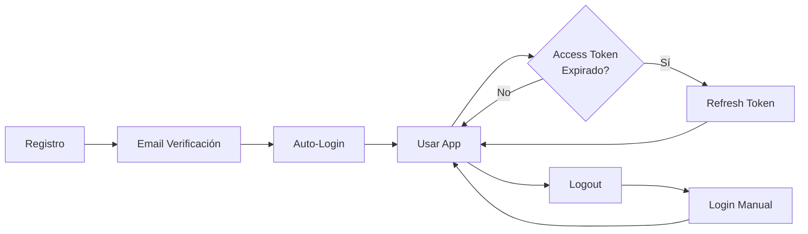

# 📚 Documentación de Flujos de Autenticación

Esta carpeta contiene la documentación detallada de todos los flujos del módulo de autenticación, con diagramas UML de secuencia y explicaciones paso a paso.

---

## 📋 Índice de Flujos

### 1. [Flujo de Registro](./register-flow.md)

**Endpoint:** `POST /auth/register`

Permite a nuevos usuarios crear una cuenta en el sistema.

**Características:**

- ✅ Validación de DTOs con mensajes en español
- ✅ Hash de contraseñas con bcrypt
- ✅ Prisma Nested Writes (User + HumanProfile)
- ✅ Generación de token de verificación de email
- ✅ Envío automático de email de verificación

---

### 2. [Flujo de Login](./login-flow.md)

**Endpoint:** `POST /auth/login`

Permite a usuarios registrados autenticarse en el sistema.

**Características:**

- ✅ Autenticación por email o username
- ✅ Validación de credenciales con bcrypt
- ✅ **Token Rotation:** Reutilización segura de sesiones
- ✅ Generación de Access Token (15 min) y Refresh Token (7 días)
- ✅ Cookies HttpOnly para máxima seguridad

---

### 3. [Flujo de Verificación de Email](./verify-email-flow.md)

**Endpoint:** `GET /auth/validate-email/:token`

Permite activar cuentas de usuarios recién registrados.

**Características:**

- ✅ Validación de token de verificación
- ✅ Verificación de expiración (1 hora)
- ✅ Activación de cuenta (`isActive: true`)
- ✅ **Auto-Login:** Inicio de sesión automático sin contraseña
- ✅ Generación de tokens JWT y cookies

---

### 4. [Flujo de Renovación de Token](./refresh-token-flow.md)

**Endpoint:** `POST /auth/refresh-token`

Permite obtener nuevos tokens JWT cuando el Access Token expira.

**Características:**

- ✅ Validación de Refresh Token
- ✅ **Token Rotation:** Cada refresh token se usa solo una vez
- ✅ Revocación automática del token anterior
- ✅ Generación de nuevo par de tokens (Access + Refresh)
- ✅ Actualización de cookies HttpOnly

---

### 5. [Flujo de Logout](./logout-flow.md)

**Endpoint:** `POST /auth/logout`

Permite a usuarios cerrar su sesión de forma segura.

**Características:**

- ✅ Revocación de Refresh Token en el servidor
- ✅ **Logout Permisivo:** Siempre exitoso, incluso con token inválido
- ✅ Limpieza de cookies del navegador
- ✅ Timestamp de desconexión

---

## 🔄 Flujo Completo del Usuario



---

## 📊 Resumen de Endpoints

| Endpoint                      | Método | Autenticación    | Descripción                        | Archivo                                          |
| ----------------------------- | ------ | ---------------- | ---------------------------------- | ------------------------------------------------ |
| `/auth/register`              | POST   | ❌ Público       | Registro de nuevo usuario          | [register-flow.md](./register-flow.md)           |
| `/auth/login`                 | POST   | ❌ Público       | Autenticación de usuario           | [login-flow.md](./login-flow.md)                 |
| `/auth/validate-email/:token` | GET    | ❌ Público       | Verificación de email + auto-login | [verify-email-flow.md](./verify-email-flow.md)   |
| `/auth/refresh-token`         | POST   | 🔐 Refresh Guard | Renovación de tokens               | [refresh-token-flow.md](./refresh-token-flow.md) |
| `/auth/logout`                | POST   | ❌ Público       | Cierre de sesión                   | [logout-flow.md](./logout-flow.md)               |

---

## 🔒 Medidas de Seguridad Globales

### 1. Contraseñas

- ✅ Hasheadas con bcrypt (10 salt rounds)
- ✅ Nunca almacenadas en texto plano
- ✅ Nunca retornadas en respuestas

### 2. Tokens JWT

- ✅ Access Token: 15 minutos de validez
- ✅ Refresh Token: 7 días de validez
- ✅ Firmados con HMAC SHA-256
- ✅ JTI hasheado con SHA-256 antes de almacenar

### 3. Token Rotation

- ✅ Refresh tokens de un solo uso
- ✅ Token anterior revocado al generar uno nuevo
- ✅ Previene replay attacks

### 4. Cookies

- ✅ HttpOnly (no accesibles desde JavaScript)
- ✅ Secure en producción (solo HTTPS)
- ✅ SameSite=Lax (protección CSRF)

### 5. Validaciones

- ✅ DTOs con class-validator
- ✅ Mensajes de error en español
- ✅ Verificación de email obligatoria
- ✅ Cuenta inactiva hasta verificar email

### 6. Base de Datos

- ✅ Prisma Nested Writes para atomicidad
- ✅ Transacciones para operaciones críticas
- ✅ Índices únicos en email y username

---

## 📁 Estructura de Archivos

```
documentation/flows/
├── README.md                    # Este archivo (índice)
├── auth-flow.md                 # Documentación completa consolidada
├── register-flow.md             # Flujo de registro
├── login-flow.md                # Flujo de login
├── verify-email-flow.md         # Flujo de verificación de email
├── refresh-token-flow.md        # Flujo de renovación de token
└── logout-flow.md               # Flujo de logout
```

---

## 🎯 Cómo Usar Esta Documentación

### Para Desarrolladores

1. **Implementar un nuevo endpoint:** Revisa el flujo correspondiente para entender el proceso completo
2. **Debugging:** Usa los diagramas UML para seguir el flujo de ejecución
3. **Modificar lógica:** Verifica que los cambios no rompan el flujo documentado

### Para QA/Testing

1. **Casos de prueba:** Cada flujo incluye errores posibles y validaciones
2. **Escenarios:** Los diagramas muestran todos los caminos (happy path + errores)
3. **Datos de prueba:** Revisa los DTOs de entrada en cada flujo

### Para Product Managers

1. **Entender el sistema:** Los diagramas visualizan el proceso completo
2. **Requisitos:** Cada flujo documenta las características implementadas
3. **Seguridad:** Revisa las medidas de seguridad en cada flujo

---

## 🔗 Enlaces Útiles

- **Código fuente:** `src/modules/auth/`
- **DTOs:** `src/modules/auth/dtos/`
- **Services:** `src/modules/auth/services/`
- **Controllers:** `src/modules/auth/controllers/`
- **Standards:** `.antigravity/skills/nestjs-standards.md`

---

## 📝 Notas

- Todos los diagramas están en formato Mermaid
- Los diagramas UML de secuencia incluyen numeración automática
- Cada flujo es independiente y puede leerse por separado
- El archivo `auth-flow.md` contiene todos los flujos consolidados

---

## 🚀 Próximos Pasos

Para extender este módulo, considera documentar:

1. **Recuperación de contraseña** (`/auth/forgot-password`, `/auth/reset-password`)
2. **Autenticación de dos factores** (2FA)
3. **OAuth/Social Login** (Google, Facebook, etc.)
4. **Gestión de sesiones** (listar, revocar sesiones específicas)
5. **Rate limiting** para prevenir ataques de fuerza bruta
