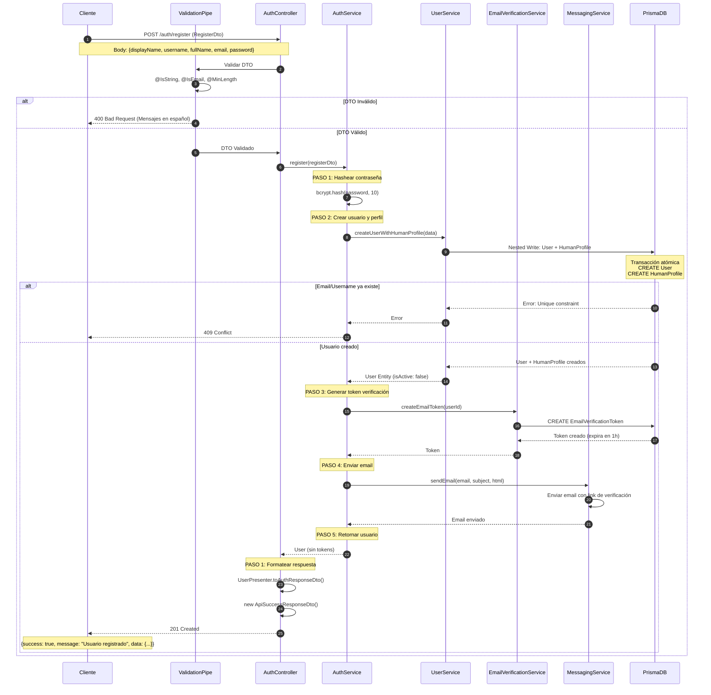
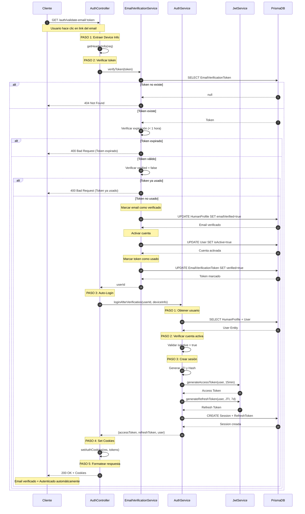
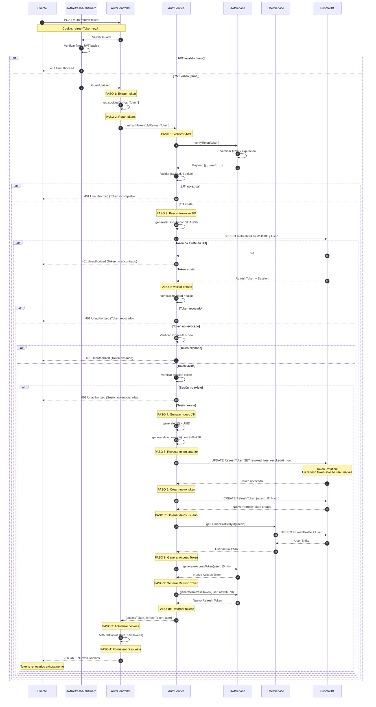
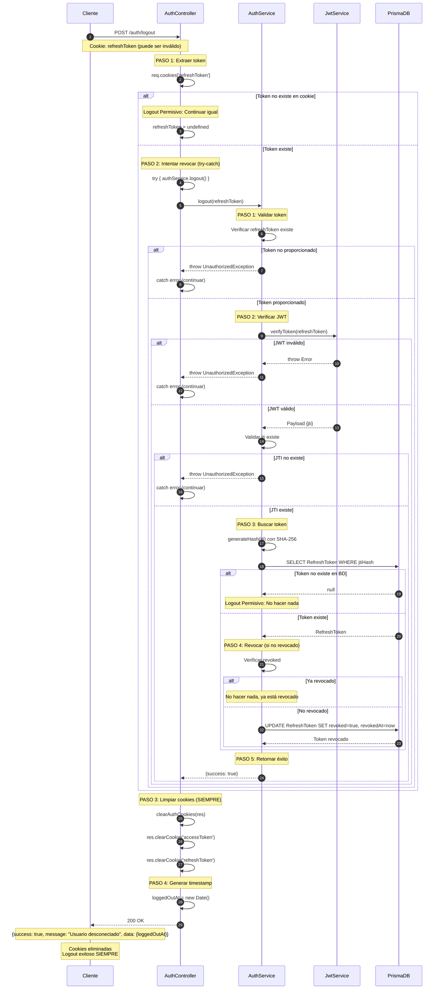

# 🔐 Documentación Completa: Módulo de Autenticación

## 📋 Tabla de Contenidos

1. [Descripción General](#descripción-general)
2. [Flujo de Registro](#1-flujo-de-registro-post-authregister)
3. [Flujo de Login](#2-flujo-de-login-post-authlogin)
4. [Flujo de Verificación de Email](#3-flujo-de-verificación-de-email-get-authvalidate-emailtoken)
5. [Flujo de Renovación de Token](#4-flujo-de-renovación-de-token-post-authrefresh-token)
6. [Flujo de Logout](#5-flujo-de-logout-post-authlogout)
7. [Diagramas UML](#diagramas-uml-de-secuencia-detallados)

---

## Descripción General

El módulo de autenticación implementa un sistema robusto de gestión de usuarios con las siguientes características:

- ✅ **Registro seguro** con verificación de email
- ✅ **Autenticación JWT** (Access Token + Refresh Token)
- ✅ **Token Rotation** para máxima seguridad
- ✅ **Sesiones múltiples** por usuario
- ✅ **Logout permisivo** para mejor UX
- ✅ **Prisma Nested Writes** para atomicidad

### Tecnologías Utilizadas

- **NestJS** v10+
- **Prisma ORM**
- **bcrypt** para hashing de contraseñas
- **JWT** para tokens de autenticación
- **class-validator** para validación de DTOs

---

## 1. Flujo de Registro (`POST /auth/register`)

### 1.1 Controller: `AuthController.register`

**Endpoint:** `POST /auth/register`  
**Input:** `RegisterDto` (validado por `ValidationPipe`)

```typescript
{
  displayName: string,
  username: string,
  fullName: string,
  email: string,
  password: string
}
```

**Proceso:**

- Recibe el DTO validado
- Delega al servicio de autenticación

#### 1.1.1 Service: `AuthService.register`

**PASO 1:** Hashear la contraseña

- Utiliza `bcrypt.hash()` con 10 salt rounds
- Asegura que la contraseña nunca se almacene en texto plano

**PASO 2:** Crear usuario y perfil en la BD

- **Prisma Nested Write:** Crea `User` + `HumanProfile` en una sola transacción atómica
- Garantiza integridad referencial (no usuarios sin perfil)
- Delega a `UserService.createUserWithHumanProfile()`

**PASO 3:** Generar token de verificación de email

- Crea token único con expiración de 1 hora
- Asocia el token al usuario recién creado

**PASO 4:** Enviar email de verificación

- Utiliza `MessagingService.sendEmail()`
- Envía enlace de verificación al correo del usuario

**PASO 5:** Retornar datos del usuario

- Usuario creado con `isActive: false`
- No se generan tokens JWT (requiere verificación primero)

### 1.2 Controller: `AuthController.register` (Continuación)

**PASO 1:** Devolver respuesta al cliente

- Formatea con `ApiSuccessResponseDto`
- Usa `UserPresenter` para excluir datos sensibles

**Output:**

```json
{
  "success": true,
  "message": "Usuario registrado exitosamente.",
  "data": {
    "userType": "HUMAN",
    "displayName": "Juan",
    "isActive": false,
    "createdAt": "2024-01-15T10:30:00Z"
  }
}
```

---

## 2. Flujo de Login (`POST /auth/login`)

### 2.1 Controller: `AuthController.login`

**Endpoint:** `POST /auth/login`  
**Input:** `LoginDto` + Headers del dispositivo

```typescript
{
  emailOrUsername: string,
  password: string
}
```

**PASO 1:** Extraer información del dispositivo

- User Agent, IP, OS, ubicación
- Utiliza `getHeaderInfo(req)`

**PASO 2:** Autenticar usuario y generar tokens

- Delega a `AuthService.login()`

#### 2.1.1 Service: `AuthService.login`

**PASO 1:** Buscar usuario por email o username

- Consulta a `UserService.findUserByUsernameOrEmail()`
- Lanza `UnauthorizedException` si no existe

**PASO 2:** Validar credenciales y estado

- Verifica contraseña con `bcrypt.compare()`
- Valida que el email esté verificado
- Valida que la cuenta esté activa (`isActive: true`)

**PASO 3:** Crear/actualizar sesión y generar tokens

- **Token Rotation:** Si existe sesión del mismo dispositivo, revoca el refresh token anterior
- Si es dispositivo nuevo, crea nueva sesión
- Genera Access Token (15 min) y Refresh Token (7 días)
- Almacena JTI hasheado (SHA-256) en la BD

**PASO 4:** Retornar tokens y datos del usuario

### 2.2 Controller: `AuthController.login` (Continuación)

**PASO 3:** Establecer tokens como cookies HttpOnly

- `accessToken`: HttpOnly, Secure (prod), SameSite=Lax
- `refreshToken`: HttpOnly, Secure (prod), SameSite=Lax

**PASO 4:** Retornar respuesta exitosa

**Output:**

```json
{
  "success": true,
  "message": "Usuario autenticado exitosamente.",
  "data": {
    "userType": "HUMAN",
    "displayName": "Juan",
    "isActive": true,
    "createdAt": "2024-01-15T10:30:00Z"
  }
}
```

- Cookies: `accessToken`, `refreshToken`

---

## 3. Flujo de Verificación de Email (`GET /auth/validate-email/:token`)

### 3.1 Controller: `AuthController.validateEmailToken`

**Endpoint:** `GET /auth/validate-email/:token`  
**Input:** Token de verificación (URL param)

**PASO 1:** Extraer información del dispositivo

- Prepara datos para auto-login posterior

**PASO 2:** Verificar token de email

- Delega a `EmailVerificationService.verifyToken()`

#### 3.1.1 Service: `EmailVerificationService.verifyToken`

- Valida que el token exista y no haya expirado
- Marca email como verificado (`emailVerified: true`)
- Activa la cuenta (`isActive: true`)
- Marca el token como usado (`verified: true`)
- Retorna el `userId`

**PASO 3:** Auto-login después de verificación

- Delega a `AuthService.loginAfterVerification()`

#### 3.1.2 Service: `AuthService.loginAfterVerification`

**PASO 1:** Obtener datos del usuario verificado

- Busca perfil por `userId`

**PASO 2:** Verificar que la cuenta esté activa

- Validación de seguridad adicional

**PASO 3:** Crear sesión y generar tokens

- Mismo proceso que login normal
- No requiere validación de contraseña (ya verificó email)

### 3.2 Controller: `AuthController.validateEmailToken` (Continuación)

**PASO 4:** Establecer tokens como cookies HttpOnly

**PASO 5:** Retornar respuesta exitosa

**Output:**

```json
{
  "success": true,
  "message": "Email verificado y sesión iniciada exitosamente.",
  "data": {
    "userType": "HUMAN",
    "displayName": "Juan",
    "isActive": true,
    "createdAt": "2024-01-15T10:30:00Z"
  }
}
```

- Cookies: `accessToken`, `refreshToken`

---

## 4. Flujo de Renovación de Token (`POST /auth/refresh-token`)

### 4.1 Controller: `AuthController.refreshToken`

**Endpoint:** `POST /auth/refresh-token`  
**Input:** Cookie `refreshToken`  
**Guard:** `JwtRefreshAuthGuard` (valida firma JWT)

**PASO 1:** Extraer refresh token de la cookie

- Lee `req.cookies['refreshToken']`

**PASO 2:** Rotar tokens (Token Rotation)

- Delega a `AuthService.refreshToken()`

#### 4.1.1 Service: `AuthService.refreshToken`

**PASO 1:** Verificar firma y extraer payload del JWT

- Valida firma con `JwtService.verifyToken()`
- Extrae JTI del payload

**PASO 2:** Buscar refresh token en BD

- Busca por hash JTI (SHA-256)
- Incluye sesión asociada

**PASO 3:** Validar estado del token

- Verifica que no esté revocado
- Verifica que no haya expirado
- Valida que la sesión exista

**PASO 4:** Generar nuevo JTI

- Crea nuevo identificador único
- Hashea con SHA-256

**PASO 5:** Revocar token anterior

- Marca como `revoked: true`
- Establece `revokedAt: new Date()`
- **Token Rotation:** Un refresh token solo se puede usar una vez

**PASO 6:** Crear nuevo refresh token en BD

- Almacena con nuevo JTI hasheado
- Asocia a la misma sesión

**PASO 7:** Obtener datos actualizados del usuario

**PASO 8:** Generar nuevo Access Token

- Válido por 15 minutos

**PASO 9:** Generar nuevo Refresh Token

- Válido por 7 días
- Incluye el nuevo JTI

**PASO 10:** Retornar nuevos tokens

### 4.2 Controller: `AuthController.refreshToken` (Continuación)

**PASO 3:** Actualizar cookies con nuevos tokens

- Reemplaza cookies anteriores

**PASO 4:** Retornar respuesta exitosa

**Output:**

```json
{
  "success": true,
  "message": "Tokens renovados exitosamente.",
  "data": {
    "userType": "HUMAN",
    "displayName": "Juan",
    "isActive": true,
    "createdAt": "2024-01-15T10:30:00Z"
  }
}
```

- Cookies: `accessToken` (nuevo), `refreshToken` (nuevo)

---

## 5. Flujo de Logout (`POST /auth/logout`)

### 5.1 Controller: `AuthController.logout`

**Endpoint:** `POST /auth/logout`  
**Input:** Cookie `refreshToken`

**PASO 1:** Extraer refresh token de la cookie

**PASO 2:** Intentar revocar token en servidor

- **Logout Permisivo:** Usa try-catch
- Si el token es inválido, continúa igual
- Delega a `AuthService.logout()`

#### 5.1.1 Service: `AuthService.logout`

**PASO 1:** Validar que se proporcionó refresh token

- Lanza `UnauthorizedException` si no existe

**PASO 2:** Verificar firma del JWT

- Valida con `JwtService.verifyToken()`
- Extrae JTI del payload

**PASO 3:** Buscar refresh token en BD

- Busca por hash JTI

**PASO 4:** Revocar token (si existe)

- Si ya estaba revocado, no hace nada
- Si no estaba revocado, lo marca como `revoked: true`

**PASO 5:** Retornar éxito siempre

- **Logout Permisivo:** Siempre retorna success

### 5.2 Controller: `AuthController.logout` (Continuación)

**PASO 3:** Limpiar cookies del navegador (SIEMPRE)

- Elimina `accessToken`
- Elimina `refreshToken`
- Usa las mismas opciones que al crearlas

**PASO 4:** Retornar timestamp de desconexión

**Output:**

```json
{
  "success": true,
  "message": "Usuario desconectado exitosamente.",
  "data": {
    "loggedOutAt": "2024-01-15T14:30:00Z"
  }
}
```

---

## 📊 Diagramas UML de Secuencia Detallados

### Diagrama UML 1: Registro de Usuario Completo



### Diagrama UML 2: Login con Token Rotation

```mermaid
sequenceDiagram
    autonumber
    participant Cliente
    participant AuthController
    participant AuthService
    participant UserService
    participant JwtService
    participant PrismaDB

    Cliente->>AuthController: POST /auth/login (LoginDto + Headers)
    Note over Cliente,AuthController: Body: {emailOrUsername, password}<br/>Headers: User-Agent, IP, etc.

    Note over AuthController: PASO 1: Extraer Device Info
    AuthController->>AuthController: getHeaderInfo(req)
    AuthController->>AuthController: {device, userAgent, ip, location, os}

    Note over AuthController: PASO 2: Autenticar usuario
    AuthController->>AuthService: login(loginDto, userAgentInfo)

    Note over AuthService: PASO 1: Buscar usuario
    AuthService->>UserService: findUserByUsernameOrEmail(emailOrUsername)
    UserService->>PrismaDB: SELECT User + HumanProfile

    alt Usuario no existe
        PrismaDB-->>UserService: null
        UserService-->>AuthService: null
        AuthService-->>Cliente: 401 Unauthorized
    else Usuario existe
        PrismaDB-->>UserService: User + HumanProfile
        UserService-->>AuthService: User Entity

        Note over AuthService: PASO 2: Validar credenciales
        AuthService->>AuthService: bcrypt.compare(password, passwordHash)

        alt Password incorrecto
            AuthService-->>Cliente: 401 Unauthorized
        else Password correcto
            AuthService->>AuthService: Verificar emailVerified = true

            alt Email no verificado
                AuthService-->>Cliente: 403 Forbidden (Email no verificado)
            else Email verificado
                AuthService->>AuthService: Verificar isActive = true

                alt Cuenta inactiva
                    AuthService-->>Cliente: 403 Forbidden (Cuenta inactiva)
                else Cuenta activa
                    Note over AuthService: PASO 3: Crear/Actualizar sesión
                    AuthService->>AuthService: createSession(user, deviceInfo)

                    AuthService->>PrismaDB: Buscar sesión existente del dispositivo

                    alt Sesión del dispositivo existe (Token Rotation)
                        PrismaDB-->>AuthService: Session + RefreshToken

                        Note over AuthService: Token Rotation: Revocar anterior
                        AuthService->>PrismaDB: UPDATE RefreshToken SET revoked=true
                        PrismaDB-->>AuthService: Token revocado

                        AuthService->>AuthService: Generar nuevo JTI
                        AuthService->>AuthService: generateHash(JTI) con SHA-256

                        AuthService->>JwtService: generateAccessToken(user, 15min)
                        JwtService-->>AuthService: Access Token

                        AuthService->>JwtService: generateRefreshToken(user, JTI, 7d)
                        JwtService-->>AuthService: Refresh Token

                        AuthService->>PrismaDB: CREATE RefreshToken (nuevo JTI Hash)
                        PrismaDB-->>AuthService: RefreshToken creado

                    else Dispositivo nuevo
                        Note over AuthService: Crear nueva sesión
                        AuthService->>AuthService: Generar JTI
                        AuthService->>AuthService: generateHash(JTI) con SHA-256

                        AuthService->>JwtService: generateAccessToken(user, 15min)
                        JwtService-->>AuthService: Access Token

                        AuthService->>JwtService: generateRefreshToken(user, JTI, 7d)
                        JwtService-->>AuthService: Refresh Token

                        AuthService->>PrismaDB: CREATE Session + RefreshToken (Nested Write)
                        Note over PrismaDB: Transacción atómica<br/>CREATE Session<br/>CREATE RefreshToken
                        PrismaDB-->>AuthService: Session + RefreshToken creados
                    end

                    Note over AuthService: PASO 4: Retornar tokens
                    AuthService-->>AuthController: {accessToken, refreshToken, user}

                    Note over AuthController: PASO 3: Set Cookies HttpOnly
                    AuthController->>AuthController: setAuthCookies(res, tokens)
                    AuthController->>AuthController: Cookie: accessToken (HttpOnly, Secure, SameSite)
                    AuthController->>AuthController: Cookie: refreshToken (HttpOnly, Secure, SameSite)

                    Note over AuthController: PASO 4: Formatear respuesta
                    AuthController->>AuthController: UserPresenter.toAuthResponseDto()

                    AuthController-->>Cliente: 200 OK + Set-Cookie Headers
                    Note over Cliente: Cookies almacenadas<br/>Usuario autenticado
                end
            end
        end
    end
```



### Diagrama UML 3: Verificación de Email + Auto-Login



### Diagrama UML 4: Renovación de Token (Token Rotation Completo)



### Diagrama UML 5: Logout Permisivo



---

## Medidas de Seguridad Implementadas

### 1. Contraseñas

- ✅ Hasheadas con bcrypt (10 salt rounds)
- ✅ Nunca almacenadas en texto plano
- ✅ Nunca retornadas en respuestas

### 2. Tokens JWT

- ✅ Access Token: 15 minutos de validez
- ✅ Refresh Token: 7 días de validez
- ✅ Firmados con HMAC SHA-256
- ✅ JTI hasheado con SHA-256 antes de almacenar

### 3. Token Rotation

- ✅ Refresh tokens de un solo uso
- ✅ Token anterior revocado al generar uno nuevo
- ✅ Previene replay attacks

### 4. Cookies

- ✅ HttpOnly (no accesibles desde JavaScript)
- ✅ Secure en producción (solo HTTPS)
- ✅ SameSite=Lax (protección CSRF)

### 5. Validaciones

- ✅ DTOs con class-validator
- ✅ Mensajes de error en español
- ✅ Verificación de email obligatoria
- ✅ Cuenta inactiva hasta verificar email

### 6. Base de Datos

- ✅ Prisma Nested Writes para atomicidad
- ✅ Transacciones para operaciones críticas
- ✅ Índices únicos en email y username

---

## 📊 Resumen de Endpoints

| Endpoint                      | Método | Autenticación    | Descripción                        |
| ----------------------------- | ------ | ---------------- | ---------------------------------- |
| `/auth/register`              | POST   | ❌ Público       | Registro de nuevo usuario          |
| `/auth/login`                 | POST   | ❌ Público       | Autenticación de usuario           |
| `/auth/validate-email/:token` | GET    | ❌ Público       | Verificación de email + auto-login |
| `/auth/refresh-token`         | POST   | 🔐 Refresh Guard | Renovación de tokens               |
| `/auth/logout`                | POST   | ❌ Público       | Cierre de sesión                   |

---

## 🎯 Próximos Pasos

Para extender este módulo, considera:

1. **Recuperación de contraseña** (`/auth/forgot-password`, `/auth/reset-password`)
2. **Autenticación de dos factores** (2FA)
3. **OAuth/Social Login** (Google, Facebook, etc.)
4. **Gestión de sesiones** (listar, revocar sesiones específicas)
5. **Rate limiting** para prevenir ataques de fuerza bruta
