# 🔐 Flujo de Login de Usuario

## 📋 Descripción General

El flujo de login permite a usuarios registrados autenticarse en el sistema. El proceso incluye:

- ✅ Autenticación por email o username
- ✅ Validación de credenciales con bcrypt
- ✅ Verificación de email y cuenta activa
- ✅ **Token Rotation:** Reutilización segura de sesiones
- ✅ Generación de Access Token (15 min) y Refresh Token (7 días)
- ✅ Cookies HttpOnly para máxima seguridad

---

## 🔄 Endpoint

**URL:** `POST /auth/login`  
**Autenticación:** ❌ Público  
**Guard:** Ninguno

---

## 📥 Request

### Body (LoginDto)

```typescript
{
  emailOrUsername: string; // Email o username
  password: string; // Contraseña
}
```

### Headers (Device Info)

El sistema extrae automáticamente:

- `User-Agent`: Información del navegador/dispositivo
- `IP Address`: Dirección IP del cliente
- `Location`: Ubicación aproximada
- `OS`: Sistema operativo

---

## 📤 Response

### Success (200 OK)

```json
{
  "success": true,
  "message": "Usuario autenticado exitosamente.",
  "data": {
    "userType": "HUMAN",
    "displayName": "Juan",
    "isActive": true,
    "emailVerified": true,
    "createdAt": "2024-01-15T10:30:00Z"
  }
}
```

**Cookies establecidas:**

- `accessToken`: HttpOnly, Secure, SameSite=Lax, 15 min
- `refreshToken`: HttpOnly, Secure, SameSite=Lax, 7 días

### Errores Posibles

| Código | Descripción                                       |
| ------ | ------------------------------------------------- |
| 400    | Bad Request - DTO inválido                        |
| 401    | Unauthorized - Credenciales incorrectas           |
| 403    | Forbidden - Email no verificado o cuenta inactiva |
| 500    | Internal Server Error                             |

---

## 🔄 Flujo Detallado

### Controller: `AuthController.login`

**PASO 1: Extraer información del dispositivo**

```typescript
const userAgentInfo = this.getHeaderInfo(req);
```

- Obtiene User-Agent, IP, OS, ubicación
- Usado para identificar sesiones por dispositivo

**PASO 2: Autenticar usuario**

```typescript
const loginUser = await this.authService.login(loginDto, userAgentInfo);
```

- Delega al servicio de autenticación

**PASO 3: Establecer tokens como cookies HttpOnly**

```typescript
this.setAuthCookies(res, loginUser.accessToken, loginUser.refreshToken);
```

- Cookies seguras (HttpOnly, Secure, SameSite)
- No accesibles desde JavaScript

**PASO 4: Formatear respuesta**

- Usa `UserPresenter.toAuthResponseDto()`
- Excluye tokens del body (solo en cookies)

---

### Service: `AuthService.login`

**PASO 1: Buscar usuario por email o username**

```typescript
const user = await this.userService.findUserByUsernameOrEmail(emailOrUsername);
```

- Busca en ambos campos
- Lanza `UnauthorizedException` si no existe

**PASO 2: Validar credenciales y estado**

**2.1 Validar contraseña:**

```typescript
const isPasswordValid = await bcrypt.compare(password, user.passwordHash);
```

- Compara con hash almacenado
- Lanza `UnauthorizedException` si no coincide

**2.2 Verificar email:**

```typescript
if (!user.emailVerified) {
  throw new ForbiddenException('Email no verificado');
}
```

**2.3 Verificar cuenta activa:**

```typescript
if (!user.isActive) {
  throw new ForbiddenException('Cuenta inactiva');
}
```

**PASO 3: Crear/actualizar sesión y generar tokens**

**3.1 Buscar sesión existente del dispositivo:**

```typescript
const existingSession = await this.prisma.session.findFirst({
  where: { userId, device: deviceInfo.device },
});
```

**3.2 Token Rotation (si existe sesión):**

```typescript
// Revocar refresh token anterior
await this.prisma.refreshToken.update({
  where: { sessionId: existingSession.id },
  data: { revoked: true, revokedAt: new Date() },
});

// Generar nuevo JTI y tokens
const newJti = this.generateJti();
const jtiHash = this.generateHash(newJti);
```

**3.3 Crear nueva sesión (dispositivo nuevo):**

```typescript
// Nested Write: Session + RefreshToken
await this.prisma.session.create({
  data: {
    userId,
    device: deviceInfo.device,
    refreshTokens: {
      create: {
        jtiHash,
        expiresAt: new Date(Date.now() + 7 * 24 * 60 * 60 * 1000),
      },
    },
  },
});
```

**3.4 Generar tokens JWT:**

```typescript
const accessToken = this.jwtService.generateAccessToken(user, '15m');
const refreshToken = this.jwtService.generateRefreshToken(user, newJti, '7d');
```

**PASO 4: Retornar tokens y datos del usuario**

---

## 📊 Diagrama UML de Secuencia

```mermaid
sequenceDiagram
    autonumber
    participant Cliente
    participant AuthController
    participant AuthService
    participant UserService
    participant JwtService
    participant PrismaDB

    Cliente->>AuthController: POST /auth/login (LoginDto + Headers)
    Note over Cliente,AuthController: Body: {emailOrUsername, password}<br/>Headers: User-Agent, IP, etc.

    Note over AuthController: PASO 1: Extraer Device Info
    AuthController->>AuthController: getHeaderInfo(req)
    AuthController->>AuthController: {device, userAgent, ip, location, os}

    Note over AuthController: PASO 2: Autenticar usuario
    AuthController->>AuthService: login(loginDto, userAgentInfo)

    Note over AuthService: PASO 1: Buscar usuario
    AuthService->>UserService: findUserByUsernameOrEmail(emailOrUsername)
    UserService->>PrismaDB: SELECT User + HumanProfile

    alt Usuario no existe
        PrismaDB-->>UserService: null
        UserService-->>AuthService: null
        AuthService-->>Cliente: 401 Unauthorized
    else Usuario existe
        PrismaDB-->>UserService: User + HumanProfile
        UserService-->>AuthService: User Entity

        Note over AuthService: PASO 2: Validar credenciales
        AuthService->>AuthService: bcrypt.compare(password, passwordHash)

        alt Password incorrecto
            AuthService-->>Cliente: 401 Unauthorized
        else Password correcto
            AuthService->>AuthService: Verificar emailVerified = true

            alt Email no verificado
                AuthService-->>Cliente: 403 Forbidden (Email no verificado)
            else Email verificado
                AuthService->>AuthService: Verificar isActive = true

                alt Cuenta inactiva
                    AuthService-->>Cliente: 403 Forbidden (Cuenta inactiva)
                else Cuenta activa
                    Note over AuthService: PASO 3: Crear/Actualizar sesión
                    AuthService->>AuthService: createSession(user, deviceInfo)

                    AuthService->>PrismaDB: Buscar sesión existente del dispositivo

                    alt Sesión del dispositivo existe (Token Rotation)
                        PrismaDB-->>AuthService: Session + RefreshToken

                        Note over AuthService: Token Rotation: Revocar anterior
                        AuthService->>PrismaDB: UPDATE RefreshToken SET revoked=true
                        PrismaDB-->>AuthService: Token revocado

                        AuthService->>AuthService: Generar nuevo JTI
                        AuthService->>AuthService: generateHash(JTI) con SHA-256

                        AuthService->>JwtService: generateAccessToken(user, 15min)
                        JwtService-->>AuthService: Access Token

                        AuthService->>JwtService: generateRefreshToken(user, JTI, 7d)
                        JwtService-->>AuthService: Refresh Token

                        AuthService->>PrismaDB: CREATE RefreshToken (nuevo JTI Hash)
                        PrismaDB-->>AuthService: RefreshToken creado

                    else Dispositivo nuevo
                        Note over AuthService: Crear nueva sesión
                        AuthService->>AuthService: Generar JTI
                        AuthService->>AuthService: generateHash(JTI) con SHA-256

                        AuthService->>JwtService: generateAccessToken(user, 15min)
                        JwtService-->>AuthService: Access Token

                        AuthService->>JwtService: generateRefreshToken(user, JTI, 7d)
                        JwtService-->>AuthService: Refresh Token

                        AuthService->>PrismaDB: CREATE Session + RefreshToken (Nested Write)
                        Note over PrismaDB: Transacción atómica<br/>CREATE Session<br/>CREATE RefreshToken
                        PrismaDB-->>AuthService: Session + RefreshToken creados
                    end

                    Note over AuthService: PASO 4: Retornar tokens
                    AuthService-->>AuthController: {accessToken, refreshToken, user}

                    Note over AuthController: PASO 3: Set Cookies HttpOnly
                    AuthController->>AuthController: setAuthCookies(res, tokens)
                    AuthController->>AuthController: Cookie: accessToken (HttpOnly, Secure, SameSite)
                    AuthController->>AuthController: Cookie: refreshToken (HttpOnly, Secure, SameSite)

                    Note over AuthController: PASO 4: Formatear respuesta
                    AuthController->>AuthController: UserPresenter.toAuthResponseDto()

                    AuthController-->>Cliente: 200 OK + Set-Cookie Headers
                    Note over Cliente: Cookies almacenadas<br/>Usuario autenticado
                end
            end
        end
    end
```



---

## 🔒 Medidas de Seguridad

1. **Autenticación:**
   - Validación con bcrypt
   - Verificación de email obligatoria
   - Cuenta debe estar activa

2. **Token Rotation:**
   - Refresh tokens de un solo uso
   - Token anterior revocado al crear uno nuevo
   - Previene replay attacks

3. **Cookies:**
   - HttpOnly (no accesibles desde JavaScript)
   - Secure en producción (solo HTTPS)
   - SameSite=Lax (protección CSRF)

4. **Sesiones:**
   - Identificación por dispositivo
   - Múltiples sesiones simultáneas permitidas
   - JTI hasheado con SHA-256

5. **Tokens JWT:**
   - Access Token: 15 minutos
   - Refresh Token: 7 días
   - Firmados con HMAC SHA-256

---

## 🎯 Próximos Pasos

Después del login exitoso:

1. **Usar Access Token** para peticiones autenticadas
2. **Renovar tokens** cuando expire → Ver [Flujo de Refresh Token](./refresh-token-flow.md)
3. **Cerrar sesión** cuando termine → Ver [Flujo de Logout](./logout-flow.md)

---

## 📝 Notas Técnicas

- **Archivo:** `src/modules/auth/controllers/auth.controller.ts`
- **Método Controller:** `AuthController.login()`
- **Método Service:** `AuthService.login()`
- **DTO:** `LoginDto`
- **Presenter:** `UserPresenter.toAuthResponseDto()`
- **Helper:** `getHeaderInfo()`, `setAuthCookies()`
