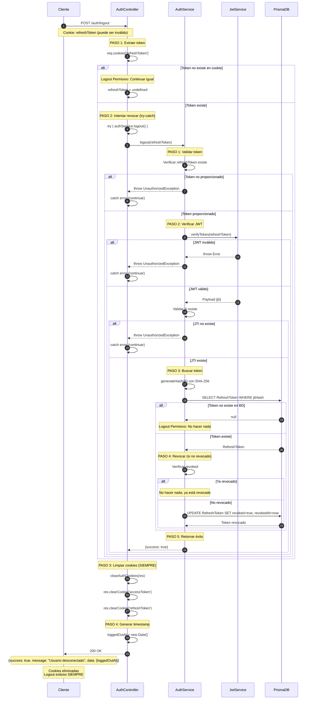

# 🔐 Flujo de Logout (Cierre de Sesión)

## 📋 Descripción General

El flujo de logout permite a usuarios cerrar su sesión de forma segura. El proceso implementa **Logout Permisivo** para mejor experiencia de usuario:

- ✅ Revocación de Refresh Token en el servidor
- ✅ **Logout Permisivo:** Siempre exitoso, incluso con token inválido
- ✅ Limpieza de cookies del navegador
- ✅ Timestamp de desconexión
- ✅ Manejo de errores con try-catch

---

## 🔄 Endpoint

**URL:** `POST /auth/logout`  
**Autenticación:** ❌ Público (no requiere token válido)  
**Guard:** Ninguno

---

## 📥 Request

### Cookies (Opcional)

```typescript
{
  refreshToken?: string;  // Cookie HttpOnly (puede ser inválido o inexistente)
}
```

El navegador envía automáticamente la cookie si existe. No se requiere body.

---

## 📤 Response

### Success (200 OK - SIEMPRE)

```json
{
  "success": true,
  "message": "Usuario desconectado exitosamente.",
  "data": {
    "loggedOutAt": "2024-01-15T14:30:00Z"
  }
}
```

**Cookies eliminadas:**

- `accessToken`: Eliminada
- `refreshToken`: Eliminada

### Errores Posibles

| Código | Descripción                      |
| ------ | -------------------------------- |
| 500    | Internal Server Error (muy raro) |

**Nota:** Este endpoint **NUNCA** retorna 401 o 403. Siempre retorna 200 OK.

---

## 🔄 Flujo Detallado

### Controller: `AuthController.logout`

**PASO 1: Extraer refresh token de la cookie**

```typescript
const refreshToken = req.cookies['refreshToken'];
```

**PASO 2: Intentar revocar token en servidor (try-catch)**

```typescript
try {
  if (refreshToken) {
    await this.authService.logout(refreshToken);
  }
} catch (error) {
  // Logout Permisivo: Ignorar errores
  // Continuar con limpieza de cookies
}
```

- **Logout Permisivo:** Si el token es inválido, continúa igual
- No lanza excepciones al usuario

**PASO 3: Limpiar cookies del navegador (SIEMPRE)**

```typescript
this.clearAuthCookies(res);
```

- Elimina `accessToken`
- Elimina `refreshToken`
- Usa las mismas opciones que al crearlas

**PASO 4: Generar timestamp de desconexión**

```typescript
const loggedOutAt = new Date();
```

**PASO 5: Retornar respuesta exitosa**

```typescript
return new ApiSuccessResponseDto({
  success: true,
  message: 'Usuario desconectado exitosamente.',
  data: { loggedOutAt },
});
```

---

### Service: `AuthService.logout`

**PASO 1: Validar que se proporcionó refresh token**

```typescript
if (!refreshToken) {
  throw new UnauthorizedException('Token no proporcionado');
}
```

**PASO 2: Verificar firma del JWT**

```typescript
const payload = await this.jwtService.verifyToken(refreshToken);
```

- Valida firma con la secret key
- Verifica que no haya expirado
- Extrae JTI del payload

**Validar que JTI existe:**

```typescript
if (!payload.jti) {
  throw new UnauthorizedException('Token incompleto');
}
```

**PASO 3: Buscar refresh token en la base de datos**

```typescript
const jtiHash = this.generateHash(payload.jti);
const tokenRecord = await this.prisma.refreshToken.findUnique({
  where: { jtiHash },
});
```

**Si no existe en BD:**

```typescript
if (!tokenRecord) {
  // Logout Permisivo: No hacer nada
  return { success: true };
}
```

**PASO 4: Revocar token (si no está revocado)**

```typescript
if (!tokenRecord.revoked) {
  await this.prisma.refreshToken.update({
    where: { id: tokenRecord.id },
    data: {
      revoked: true,
      revokedAt: new Date(),
    },
  });
}
```

- Si ya estaba revocado, no hace nada
- Marca el token como inválido

**PASO 5: Retornar éxito**

```typescript
return { success: true };
```

---

## 📊 Diagrama UML de Secuencia



---

## 🔒 Medidas de Seguridad

1. **Logout Permisivo:**
   - Siempre retorna 200 OK
   - Mejora la experiencia de usuario
   - Evita errores confusos al cerrar sesión
   - Cookies siempre se eliminan

2. **Revocación en Servidor:**
   - Intenta revocar el token en BD
   - Si falla, continúa con limpieza de cookies
   - Previene reutilización del token

3. **Limpieza de Cookies:**
   - Siempre elimina cookies del navegador
   - Usa las mismas opciones que al crearlas
   - Garantiza que no queden tokens en el cliente

4. **Try-Catch:**
   - Captura cualquier error en la revocación
   - No interrumpe el flujo de logout
   - Logs de errores para debugging

---

## 🎯 Casos de Uso

### Caso 1: Logout Normal

Usuario con sesión válida cierra sesión:

1. Token válido en cookie
2. Token revocado en BD
3. Cookies eliminadas
4. ✅ Logout exitoso

### Caso 2: Token Expirado

Usuario con token expirado cierra sesión:

1. Token expirado en cookie
2. Verificación JWT falla
3. Error capturado (try-catch)
4. Cookies eliminadas
5. ✅ Logout exitoso

### Caso 3: Sin Token

Usuario sin cookies cierra sesión:

1. No hay token en cookie
2. No se intenta revocar
3. Cookies eliminadas (no hay nada que eliminar)
4. ✅ Logout exitoso

### Caso 4: Token Inválido

Usuario con token manipulado cierra sesión:

1. Token inválido en cookie
2. Verificación JWT falla
3. Error capturado (try-catch)
4. Cookies eliminadas
5. ✅ Logout exitoso

---

## 💡 ¿Por Qué Logout Permisivo?

### Ventajas

1. **Mejor UX:** Usuario siempre puede cerrar sesión
2. **Sin confusión:** No hay errores al hacer logout
3. **Seguridad:** Cookies siempre se eliminan del cliente
4. **Robustez:** Funciona incluso con tokens corruptos

### Comparación

| Enfoque       | Token Inválido | UX         | Seguridad             |
| ------------- | -------------- | ---------- | --------------------- |
| **Permisivo** | ✅ 200 OK      | ⭐⭐⭐⭐⭐ | ✅ Cookies eliminadas |
| Estricto      | ❌ 401 Error   | ⭐⭐       | ✅ Cookies eliminadas |

---

## 🔄 Flujo Posterior al Logout

Después del logout exitoso:

1. **Usuario desautenticado** en el cliente
2. **Token revocado** en el servidor (si era válido)
3. **Cookies eliminadas** del navegador
4. **Debe hacer login** para volver a autenticarse → Ver [Flujo de Login](./login-flow.md)

---

## 📝 Notas Técnicas

- **Archivo:** `src/modules/auth/controllers/auth.controller.ts`
- **Método Controller:** `AuthController.logout()`
- **Método Service:** `AuthService.logout()`
- **Helper:** `clearAuthCookies()`

---

## 🚀 Implementación Frontend

### Ejemplo con Axios

```typescript
async function logout() {
  try {
    await axios.post('/auth/logout');
    // Redirigir a login
    window.location.href = '/login';
  } catch (error) {
    // Esto nunca debería ocurrir (logout permisivo)
    console.error('Error inesperado en logout:', error);
    // Redirigir igual
    window.location.href = '/login';
  }
}
```

### Ejemplo con Fetch

```typescript
async function logout() {
  await fetch('/auth/logout', {
    method: 'POST',
    credentials: 'include', // Enviar cookies
  });
  // Siempre exitoso, redirigir
  window.location.href = '/login';
}
```

---

## 🔍 Debugging

Si necesitas verificar el logout:

1. **Revisar cookies del navegador** (deben estar eliminadas)
2. **Verificar en BD** que el token esté revocado
3. **Intentar usar el token** (debe fallar con 401)
4. **Revisar logs del servidor** para errores capturados

---

## 📊 Métricas Útiles

- **Tasa de logout exitoso:** Debería ser ~100%
- **Errores capturados:** Tokens inválidos/expirados
- **Tiempo promedio:** < 100ms
- **Tokens revocados:** Contador de sesiones cerradas
