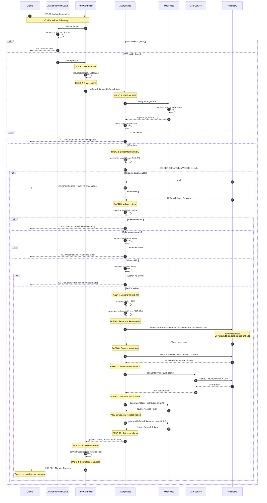

# 🔐 Flujo de Renovación de Token (Token Rotation)

## 📋 Descripción General

El flujo de renovación de token permite obtener nuevos tokens JWT cuando el Access Token expira. El proceso implementa **Token Rotation** para máxima seguridad:

- ✅ Validación de Refresh Token
- ✅ **Token Rotation:** Cada refresh token se usa solo una vez
- ✅ Revocación automática del token anterior
- ✅ Generación de nuevo par de tokens (Access + Refresh)
- ✅ Actualización de cookies HttpOnly
- ✅ Datos de usuario actualizados

---

## 🔄 Endpoint

**URL:** `POST /auth/refresh-token`  
**Autenticación:** 🔐 Requiere Refresh Token  
**Guard:** `JwtRefreshAuthGuard`

---

## 📥 Request

### Cookies (Automático)

```typescript
{
  refreshToken: string; // Cookie HttpOnly con el refresh token
}
```

El navegador envía automáticamente la cookie. No se requiere body.

---

## 📤 Response

### Success (200 OK)

```json
{
  "success": true,
  "message": "Tokens renovados exitosamente.",
  "data": {
    "userType": "HUMAN",
    "displayName": "Juan",
    "isActive": true,
    "emailVerified": true,
    "createdAt": "2024-01-15T10:30:00Z"
  }
}
```

**Cookies actualizadas:**

- `accessToken`: Nuevo token (15 min)
- `refreshToken`: Nuevo token (7 días)

### Errores Posibles

| Código | Descripción                                                       |
| ------ | ----------------------------------------------------------------- |
| 401    | Unauthorized - Token inválido, expirado, revocado o no encontrado |
| 500    | Internal Server Error                                             |

---

## 🔄 Flujo Detallado

### Controller: `AuthController.refreshToken`

**PASO 1: Extraer refresh token de la cookie**

```typescript
const oldRefreshToken = req.cookies['refreshToken'];
```

**PASO 2: Rotar tokens (Token Rotation)**

```typescript
const result = await this.authService.refreshToken(oldRefreshToken);
```

**PASO 3: Actualizar cookies con nuevos tokens**

```typescript
this.setAuthCookies(res, result.accessToken, result.refreshToken);
```

**PASO 4: Formatear respuesta**

```typescript
return new ApiSuccessResponseDto({
  success: true,
  message: 'Tokens renovados exitosamente.',
  data: UserPresenter.toAuthResponseDto(result.user),
});
```

---

### Service: `AuthService.refreshToken`

**PASO 1: Verificar firma del JWT y extraer payload**

```typescript
const payload = await this.jwtService.verifyToken(oldRefreshToken);
```

- Valida firma con la secret key
- Verifica que no haya expirado
- Extrae JTI del payload

**Validar que JTI existe:**

```typescript
if (!payload.jti) {
  throw new UnauthorizedException('Token incompleto');
}
```

**PASO 2: Buscar refresh token en la base de datos**

```typescript
const jtiHash = this.generateHash(payload.jti);
const refreshToken = await this.prisma.refreshToken.findUnique({
  where: { jtiHash },
  include: { session: true },
});
```

- Busca por hash del JTI (SHA-256)
- Incluye sesión asociada

**Validar que existe:**

```typescript
if (!refreshToken) {
  throw new UnauthorizedException('Token no encontrado');
}
```

**PASO 3: Validar estado del token**

**3.1 Verificar que no esté revocado:**

```typescript
if (refreshToken.revoked) {
  throw new UnauthorizedException('Token revocado');
}
```

**3.2 Verificar que no haya expirado:**

```typescript
if (refreshToken.expiresAt < new Date()) {
  throw new UnauthorizedException('Token expirado');
}
```

**3.3 Verificar que la sesión exista:**

```typescript
if (!refreshToken.session) {
  throw new UnauthorizedException('Sesión no encontrada');
}
```

**PASO 4: Generar nuevo JTI**

```typescript
const newJti = this.generateJti(); // UUID v4
const newJtiHash = this.generateHash(newJti); // SHA-256
```

**PASO 5: Revocar token anterior**

```typescript
await this.prisma.refreshToken.update({
  where: { id: refreshToken.id },
  data: {
    revoked: true,
    revokedAt: new Date(),
  },
});
```

- **Token Rotation:** El token anterior ya no se puede usar
- Previene replay attacks

**PASO 6: Crear nuevo refresh token en BD**

```typescript
await this.prisma.refreshToken.create({
  data: {
    sessionId: refreshToken.sessionId,
    jtiHash: newJtiHash,
    expiresAt: new Date(Date.now() + 7 * 24 * 60 * 60 * 1000),
  },
});
```

**PASO 7: Obtener datos actualizados del usuario**

```typescript
const user = await this.userService.getHumanProfileById(payload.userId);
```

- Obtiene datos frescos de la BD
- Incluye cambios recientes en el perfil

**PASO 8: Generar nuevo Access Token**

```typescript
const newAccessToken = this.jwtService.generateAccessToken(user, '15m');
```

**PASO 9: Generar nuevo Refresh Token**

```typescript
const newRefreshToken = this.jwtService.generateRefreshToken(
  user,
  newJti,
  '7d',
);
```

- Incluye el nuevo JTI en el payload

**PASO 10: Retornar nuevos tokens y datos del usuario**

```typescript
return {
  accessToken: newAccessToken,
  refreshToken: newRefreshToken,
  user,
};
```

---

## 📊 Diagrama UML de Secuencia



---

## 🔒 Medidas de Seguridad

1. **Token Rotation:**
   - Cada refresh token se usa **solo una vez**
   - Token anterior revocado inmediatamente
   - Previene replay attacks
   - Si se intenta reusar, se detecta como revocado

2. **Validaciones Múltiples:**
   - Firma JWT válida
   - Token no expirado
   - Token no revocado
   - Sesión existente
   - JTI presente en payload

3. **JTI Hashing:**
   - JTI hasheado con SHA-256 antes de almacenar
   - No se almacena el JTI en texto plano
   - Protección adicional en caso de breach

4. **Cookies Seguras:**
   - HttpOnly (no accesibles desde JavaScript)
   - Secure en producción (solo HTTPS)
   - SameSite=Lax (protección CSRF)

5. **Datos Actualizados:**
   - Obtiene datos frescos del usuario en cada refresh
   - Refleja cambios recientes en el perfil

---

## 🎯 Cuándo Usar Este Endpoint

### Uso Automático

El frontend debe llamar a este endpoint automáticamente cuando:

1. **Access Token expira** (después de 15 minutos)
2. **Antes de que expire** (refresh proactivo a los 14 min)
3. **Al recibir 401** en peticiones autenticadas

### Ejemplo de Implementación (Frontend)

```typescript
// Interceptor de Axios
axios.interceptors.response.use(
  (response) => response,
  async (error) => {
    if (error.response?.status === 401) {
      // Intentar refresh
      await axios.post('/auth/refresh-token');
      // Reintentar petición original
      return axios.request(error.config);
    }
    return Promise.reject(error);
  },
);
```

---

## 🔄 Ciclo de Vida de los Tokens

```
Login
  ↓
Access Token (15 min) + Refresh Token (7 días)
  ↓
[Después de 15 min]
  ↓
Access Token expira
  ↓
POST /auth/refresh-token
  ↓
Nuevo Access Token (15 min) + Nuevo Refresh Token (7 días)
  ↓
Token anterior revocado
  ↓
[Repetir cada 15 min hasta que Refresh Token expire o logout]
```

---

## 📝 Notas Técnicas

- **Archivo:** `src/modules/auth/controllers/auth.controller.ts`
- **Método Controller:** `AuthController.refreshToken()`
- **Método Service:** `AuthService.refreshToken()`
- **Guard:** `JwtRefreshAuthGuard`
- **Presenter:** `UserPresenter.toAuthResponseDto()`

---

## 💡 Consideraciones

- Si el Refresh Token expira (7 días), el usuario debe hacer login nuevamente
- El Token Rotation previene que tokens robados sean reutilizados
- Cada refresh genera un nuevo par de tokens (Access + Refresh)
- El JTI es único para cada Refresh Token
- La sesión se mantiene activa mientras se renueven los tokens
