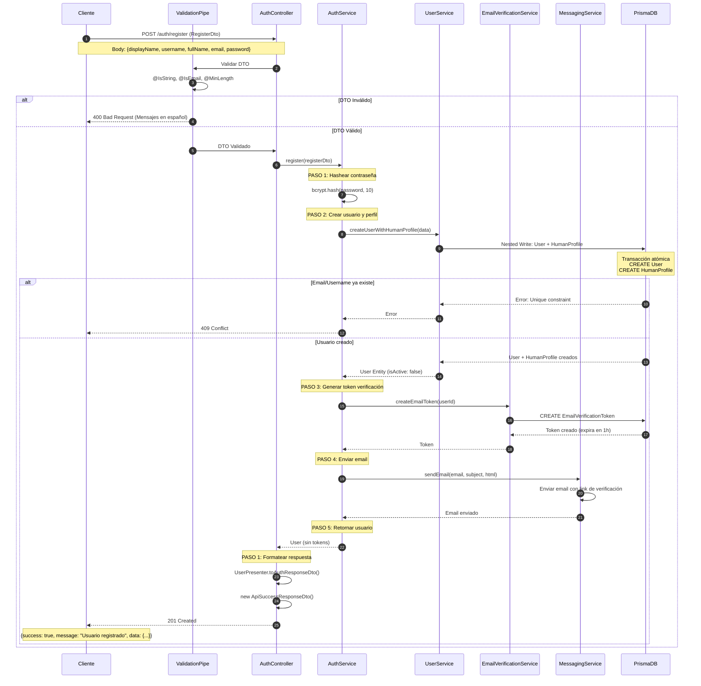

# 🔐 Flujo de Registro de Usuario

## 📋 Descripción General

El flujo de registro permite a nuevos usuarios crear una cuenta en el sistema. El proceso incluye:

- ✅ Validación de datos con DTOs
- ✅ Hash seguro de contraseñas con bcrypt
- ✅ Creación atómica de User + HumanProfile (Nested Write)
- ✅ Generación de token de verificación de email
- ✅ Envío automático de email de verificación
- ✅ Cuenta inactiva hasta verificar email

---

## 🔄 Endpoint

**URL:** `POST /auth/register`  
**Autenticación:** ❌ Público  
**Guard:** Ninguno

---

## 📥 Request

### Body (RegisterDto)

```typescript
{
  displayName: string; // Nombre para mostrar
  username: string; // Nombre de usuario único
  fullName: string; // Nombre completo
  email: string; // Email único
  password: string; // Contraseña (min 8 caracteres)
}
```

### Validaciones

- `displayName`: @IsString, @IsNotEmpty
- `username`: @IsString, @IsNotEmpty, único en BD
- `fullName`: @IsString, @IsNotEmpty
- `email`: @IsEmail, único en BD
- `password`: @IsString, @MinLength(8)

---

## 📤 Response

### Success (201 Created)

```json
{
  "success": true,
  "message": "Usuario registrado exitosamente.",
  "data": {
    "userType": "HUMAN",
    "displayName": "Juan",
    "isActive": false,
    "emailVerified": false,
    "createdAt": "2024-01-15T10:30:00Z"
  }
}
```

### Errores Posibles

| Código | Descripción                           |
| ------ | ------------------------------------- |
| 400    | Bad Request - DTO inválido            |
| 409    | Conflict - Email o username ya existe |
| 500    | Internal Server Error                 |

---

## 🔄 Flujo Detallado

### Controller: `AuthController.register`

**PASO 1:** Recibir y validar DTO

- `ValidationPipe` valida automáticamente
- Mensajes de error en español

**PASO 2:** Delegar al servicio

- Llama a `AuthService.register(registerDto)`

**PASO 3:** Formatear respuesta

- Usa `UserPresenter.toAuthResponseDto()`
- Excluye datos sensibles (passwordHash)

---

### Service: `AuthService.register`

**PASO 1: Hashear la contraseña**

```typescript
const passwordHash = await bcrypt.hash(password, 10);
```

- Usa bcrypt con 10 salt rounds
- Nunca almacena contraseña en texto plano

**PASO 2: Crear usuario y perfil en la base de datos**

```typescript
const registerUser = await this.userService.createUserWithHumanProfile({
  displayName,
  ...human,
  passwordHash,
});
```

- **Prisma Nested Write:** Crea User + HumanProfile atómicamente
- Si falla, ambos se revierten (transacción)
- Usuario creado con `isActive: false`

**PASO 3: Generar token de verificación de email**

```typescript
const verification = await this.emailVerificationService.createEmailToken(
  registerUser.id,
);
```

- Token único con expiración de 1 hora
- Almacenado en tabla `EmailVerificationToken`

**PASO 4: Enviar email de verificación**

```typescript
await this.messagingService.sendEmail(
  human.email,
  'Verificación de correo',
  `<p>Por favor, verifica tu correo haciendo clic en el siguiente enlace: ${verification.token}</p>`,
);
```

- Email con link de verificación
- Usuario debe hacer clic para activar cuenta

**PASO 5: Retornar datos del usuario creado**

- Usuario sin tokens JWT (requiere verificación)
- `isActive: false`, `emailVerified: false`

---

## 📊 Diagrama UML de Secuencia



---

## 🔒 Medidas de Seguridad

1. **Contraseñas:**
   - Hasheadas con bcrypt (10 salt rounds)
   - Nunca almacenadas en texto plano
   - Nunca retornadas en respuestas

2. **Validación:**
   - DTOs con class-validator
   - Mensajes de error en español
   - Validación de formato de email

3. **Base de Datos:**
   - Nested Writes para atomicidad
   - Índices únicos en email y username
   - Previene duplicados

4. **Email:**
   - Token de verificación con expiración
   - Cuenta inactiva hasta verificar
   - Previene cuentas spam

---

## 🎯 Próximos Pasos

Después del registro, el usuario debe:

1. **Revisar su email** y hacer clic en el link de verificación
2. **Verificar su cuenta** → Ver [Flujo de Verificación de Email](./verify-email-flow.md)
3. **Iniciar sesión** → Ver [Flujo de Login](./login-flow.md)

---

## 📝 Notas Técnicas

- **Archivo:** `src/modules/auth/controllers/auth.controller.ts`
- **Método Controller:** `AuthController.register()`
- **Método Service:** `AuthService.register()`
- **DTO:** `RegisterDto`
- **Presenter:** `UserPresenter.toAuthResponseDto()`
