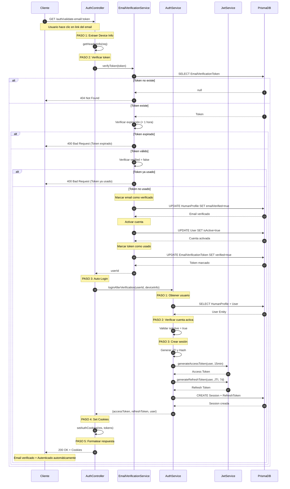

# 🔐 Flujo de Verificación de Email + Auto-Login

## 📋 Descripción General

El flujo de verificación de email permite activar cuentas de usuarios recién registrados. El proceso incluye:

- ✅ Validación de token de verificación
- ✅ Verificación de expiración (1 hora)
- ✅ Activación de cuenta (`isActive: true`)
- ✅ Marcado de email como verificado (`emailVerified: true`)
- ✅ **Auto-Login:** Inicio de sesión automático sin contraseña
- ✅ Generación de tokens JWT y cookies

---

## 🔄 Endpoint

**URL:** `GET /auth/validate-email/:token`  
**Autenticación:** ❌ Público  
**Guard:** Ninguno

---

## 📥 Request

### URL Params

```typescript
{
  token: string; // Token de verificación enviado por email
}
```

### Headers (Device Info)

El sistema extrae automáticamente:

- `User-Agent`: Información del navegador/dispositivo
- `IP Address`: Dirección IP del cliente
- `Location`: Ubicación aproximada
- `OS`: Sistema operativo

---

## 📤 Response

### Success (200 OK)

```json
{
  "success": true,
  "message": "Email verificado y sesión iniciada exitosamente.",
  "data": {
    "userType": "HUMAN",
    "displayName": "Juan",
    "isActive": true,
    "emailVerified": true,
    "createdAt": "2024-01-15T10:30:00Z"
  }
}
```

**Cookies establecidas:**

- `accessToken`: HttpOnly, Secure, SameSite=Lax, 15 min
- `refreshToken`: HttpOnly, Secure, SameSite=Lax, 7 días

### Errores Posibles

| Código | Descripción                             |
| ------ | --------------------------------------- |
| 400    | Bad Request - Token expirado o ya usado |
| 404    | Not Found - Token no existe             |
| 500    | Internal Server Error                   |

---

## 🔄 Flujo Detallado

### Controller: `AuthController.validateEmailToken`

**PASO 1: Extraer información del dispositivo**

```typescript
const userAgentInfo = this.getHeaderInfo(req);
```

- Prepara datos para auto-login posterior

**PASO 2: Verificar token de email**

```typescript
const userId = await this.emailVerificationService.verifyToken(token);
```

- Delega al servicio de verificación de email

---

### Service: `EmailVerificationService.verifyToken`

**Validaciones del token:**

1. **Verificar que el token existe:**

```typescript
const tokenRecord = await this.prisma.emailVerificationToken.findUnique({
  where: { token },
});
if (!tokenRecord) throw new NotFoundException('Token no encontrado');
```

2. **Verificar que no ha expirado (< 1 hora):**

```typescript
const now = new Date();
if (tokenRecord.expiresAt < now) {
  throw new BadRequestException('Token expirado');
}
```

3. **Verificar que no ha sido usado:**

```typescript
if (tokenRecord.verified) {
  throw new BadRequestException('Token ya utilizado');
}
```

**Actualización de datos:**

1. **Marcar email como verificado:**

```typescript
await this.prisma.humanProfile.update({
  where: { userId: tokenRecord.userId },
  data: { emailVerified: true },
});
```

2. **Activar cuenta:**

```typescript
await this.prisma.user.update({
  where: { id: tokenRecord.userId },
  data: { isActive: true },
});
```

3. **Marcar token como usado:**

```typescript
await this.prisma.emailVerificationToken.update({
  where: { id: tokenRecord.id },
  data: { verified: true, verifiedAt: new Date() },
});
```

4. **Retornar userId:**

```typescript
return tokenRecord.userId;
```

---

### Controller: `AuthController.validateEmailToken` (Continuación)

**PASO 3: Auto-login después de verificación**

```typescript
const loginUser = await this.authService.loginAfterVerification(
  userId,
  userAgentInfo,
);
```

---

### Service: `AuthService.loginAfterVerification`

**PASO 1: Obtener datos del usuario verificado**

```typescript
const user = await this.userService.getHumanProfileById(userId);
```

- Busca perfil completo del usuario

**PASO 2: Verificar que la cuenta esté activa**

```typescript
if (!user.isActive) {
  throw new ForbiddenException('Cuenta inactiva');
}
```

- Validación de seguridad adicional

**PASO 3: Crear sesión y generar tokens**

```typescript
// Generar JTI y hash
const jti = this.generateJti();
const jtiHash = this.generateHash(jti);

// Generar tokens
const accessToken = this.jwtService.generateAccessToken(user, '15m');
const refreshToken = this.jwtService.generateRefreshToken(user, jti, '7d');

// Crear sesión con Nested Write
await this.prisma.session.create({
  data: {
    userId,
    device: deviceInfo.device,
    refreshTokens: {
      create: {
        jtiHash,
        expiresAt: new Date(Date.now() + 7 * 24 * 60 * 60 * 1000),
      },
    },
  },
});
```

---

### Controller: `AuthController.validateEmailToken` (Continuación)

**PASO 4: Establecer tokens como cookies HttpOnly**

```typescript
this.setAuthCookies(res, loginUser.accessToken, loginUser.refreshToken);
```

**PASO 5: Formatear respuesta**

```typescript
return new ApiSuccessResponseDto({
  success: true,
  message: 'Email verificado y sesión iniciada exitosamente.',
  data: UserPresenter.toAuthResponseDto(loginUser),
});
```

---

## 📊 Diagrama UML de Secuencia



---

## 🔒 Medidas de Seguridad

1. **Token de Verificación:**
   - Token único generado con UUID
   - Expiración de 1 hora
   - Un solo uso (marcado como `verified`)
   - Almacenado en BD

2. **Auto-Login:**
   - No requiere contraseña (ya verificó email)
   - Genera sesión completa con tokens
   - Cookies HttpOnly seguras

3. **Validaciones:**
   - Token debe existir
   - Token no debe estar expirado
   - Token no debe haber sido usado
   - Cuenta debe activarse correctamente

4. **Atomicidad:**
   - Múltiples actualizaciones en BD
   - Si falla alguna, se revierte todo

---

## 🎯 Próximos Pasos

Después de la verificación exitosa:

1. **Usuario autenticado automáticamente** con cookies
2. **Puede usar la aplicación** inmediatamente
3. **Tokens válidos** por 15 min (access) y 7 días (refresh)
4. **Renovar tokens** cuando expire → Ver [Flujo de Refresh Token](./refresh-token-flow.md)

---

## 📝 Notas Técnicas

- **Archivo Controller:** `src/modules/auth/controllers/auth.controller.ts`
- **Archivo Service Auth:** `src/modules/auth/services/auth.service.ts`
- **Archivo Service Email:** `src/modules/email-verification/email-verification.service.ts`
- **Método Controller:** `AuthController.validateEmailToken()`
- **Método Service Auth:** `AuthService.loginAfterVerification()`
- **Método Service Email:** `EmailVerificationService.verifyToken()`
- **Presenter:** `UserPresenter.toAuthResponseDto()`

---

## 💡 Consideraciones

- El token de verificación se envía por email al registrarse
- El link tiene el formato: `https://app.com/auth/validate-email/TOKEN`
- Si el token expira, el usuario debe solicitar uno nuevo
- El auto-login mejora la UX (no requiere login manual después de verificar)
